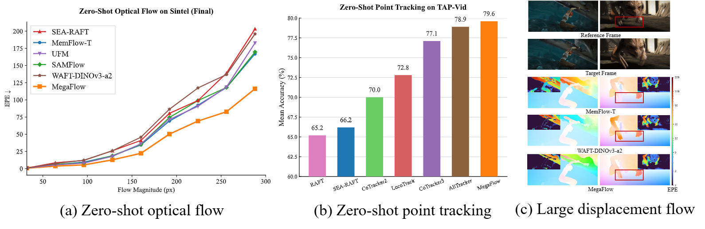

<div align="center">
  <h1>MegaFlow: Zero-Shot Large Displacement Optical Flow</h1>

  <strong><a href="https://kristen-z.github.io/">Dingxi Zhang</a></strong><sup>1</sup>&nbsp;&nbsp;&nbsp;&nbsp;
  <strong><a href="https://fangjinhuawang.github.io/">Fangjinhua Wang</a></strong><sup>1</sup>&nbsp;&nbsp;&nbsp;&nbsp;
  <strong><a href="https://people.inf.ethz.ch/marc.pollefeys/">Marc Pollefeys</a></strong><sup>1,2</sup>&nbsp;&nbsp;&nbsp;&nbsp;
  <strong><a href="https://haofeixu.github.io/">Haofei Xu</a></strong><sup>1,3</sup>

  <sup>1</sup> <em>ETH Zurich</em>&nbsp;&nbsp;&nbsp;&nbsp;&nbsp;&nbsp;
  <sup>2</sup> <em>Microsoft</em>&nbsp;&nbsp;&nbsp;&nbsp;&nbsp;&nbsp;
  <sup>3</sup> <em>University of Tübingen, Tübingen AI Center</em>

  <a href="https://kristen-z.github.io/projects/megaflow/"></a>
  <a href="https://arxiv.org/abs/2603.25739"></a>
  <a href="https://huggingface.co/spaces/Kristen-Z/MegaFlow-demo" target="_blank"></a>
  <a href="https://colab.research.google.com/github/cvg/megaflow/blob/main/demo_colab.ipynb"></a>
</div>

<p align="center">
  
</p>

**MegaFlow** is a simple, powerful, and unified model for **zero-shot large displacement optical flow** and **point tracking**. 

MegaFlow leverages pre-trained Vision Transformer features to naturally capture extreme motion, followed by a lightweight iterative refinement for sub-pixel accuracy. This approach achieves **state-of-the-art zero-shot performance** across major optical flow benchmarks (Sintel, KITTI, Spring) while delivering highly competitive zero-shot generalizability on long-range point tracking benchmarks.

## Highlights

- 🏆 Strong zero-shot performance across Sintel, Spring, and KITTI
- 🎯 Excels in large displacement optical flow estimation
- 📹 Flexible temporal window: seamlessly processes any number of frames
- 🔄 General motion backbone: naturally extends to point tracking

## Installation

```bash
# Clone the repository
git clone https://github.com/cvg/megaflow.git
cd megaflow

# Create local conda environment
conda create -n megaflow python=3.12 -y
conda activate megaflow

# Install dependencies
pip install -e .

# (Optional) Install FlashAttention-3 for faster inference on Hopper GPUs
git clone https://github.com/Dao-AILab/flash-attention.git
cd flash-attention/hopper
python setup.py install
cd ../..
```

Or install directly:
```bash
pip install git+https://github.com/cvg/megaflow.git
```

**Requirements**: Python ≥ 3.12, PyTorch ≥ 2.7, CUDA recommended.

## Pretrained Models

Pretrained checkpoints are available on [🤗 HuggingFace](https://huggingface.co/Kristen-Z/MegaFlow) and are auto-downloaded:

| Model Name | Description |
|------------|-------------|
| `megaflow-flow` | Optical flow (default) |
| `megaflow-chairs-things` | Optical flow trained on FlyingThings and FlyingChairs |
| `megaflow-track` | Point tracking (Kubric fine-tuned) |

```python
import torch
from megaflow import MegaFlow
from megaflow.utils.basic import gridcloud2d

device = "cuda" if torch.cuda.is_available() else "cpu"

# Prepare video tensor [1, T, 3, H, W] in float32, range [0, 255]
video = ...

with torch.inference_mode():
    with torch.autocast(device_type=device, dtype=torch.bfloat16, enabled=True):
        # --- Task 1: Optical Flow ---
        flow_model = MegaFlow.from_pretrained("megaflow-flow").eval().to(device)
        # Returns flow predictions for consecutive frame pairs (0->1, 1->2...)
        flow_predictions = flow_model(video, num_reg_refine=8)["flow_preds"][-1]

        # --- Task 2: Point Tracking ---
        track_model = MegaFlow.from_pretrained("megaflow-track").eval().to(device)
        # Returns tracking offsets between first frame and query frame (0->t)
        flows_e = track_model.forward_track(video, num_reg_refine=8)["flow_final"]
        # Add absolute grid coordinates to get final point tracks
        grid_xy = gridcloud2d(1, H, W, norm=False, device=device).float()  
        grid_xy = grid_xy.permute(0, 2, 1).reshape(1, 1, 2, H, W)  
        tracking_predictions = flows_e + grid_xy
```

## Demo

### Optical Flow Estimation

```bash
# Processes the video and auto-downloads the megaflow-flow model
python demo_flow.py --input assets/longboard.mp4 --output output/longboard_flow.mp4
```

### Point Tracking

```bash
# Tracks points and auto-downloads the megaflow-track model
python demo_track.py --input assets/apple.mp4 --grid_size 8
```
You can also run `python demo_gradio.py` to launch a local web UI, try our [HuggingFace demo](https://huggingface.co/spaces/Kristen-Z/MegaFlow-demo) or open the [Colab notebook](https://colab.research.google.com/github/cvg/megaflow/blob/main/demo_colab.ipynb) for an interactive online demo directly in the browser.


## Datasets

To train and evaluate MegaFlow, you will need to download the required datasets: [FlyingChairs](https://lmb.informatik.uni-freiburg.de/resources/datasets/FlyingChairs.en.html), [FlyingThings3D](https://lmb.informatik.uni-freiburg.de/resources/datasets/SceneFlowDatasets.en.html), [Sintel](http://sintel.is.tue.mpg.de/), [KITTI](http://www.cvlibs.net/datasets/kitti/eval_scene_flow.php?benchmark=flow), [HD1K](http://hci-benchmark.iwr.uni-heidelberg.de/), [TartanAir](https://theairlab.org/tartanair-dataset/), and [Spring](https://spring-benchmark.org/).

For tracking, you will need to download processed Kubric from  [AllTracker](https://github.com/ShenZheng2000/AllTracker) and TAP-Vid:
- **Kubric:** Download the 24-frame data ([kubric_au.tar.gz](https://huggingface.co/datasets/aharley/alltracker_data/resolve/main/kubric_au.tar.gz?download=true)) and the 64-frame data parts ([part1](https://huggingface.co/datasets/aharley/alltracker_data/resolve/main/ce64_kub_aa?download=true), [part2](https://huggingface.co/datasets/aharley/alltracker_data/resolve/main/ce64_kub_ab?download=true), [part3](https://huggingface.co/datasets/aharley/alltracker_data/resolve/main/ce64_kub_ac?download=true)).
- **TAP-Vid:** Download the TAP-Vid-DAVIS, TAP-Vid-RGB-stacking and TAP-Vid-Kinetics datasets from [here](https://github.com/google-deepmind/tapnet/tree/main/tapnet/tapvid) for evaluation.

Merge the point tracking splits by concatenating:
```bash
cat ce64_kub_aa ce64_kub_ab ce64_kub_ac > ce64_kub.tar.gz
```

By default `datasets.py` will search for the datasets in these locations. You can create symbolic links to wherever the datasets were downloaded in the `datasets` folder:

```shell
├── datasets
    ├── FlyingChairs_release
    ├── FlyingThings3D
    ├── Sintel
    ├── KITTI
    ├── HD1K
    ├── spring
    ├── TartanAir
    ├── kubric_au/
    └── TAP_Vid/
        ├── tapvid_davis/
        ├── tapvid_kinetics/
        └── tapvid_rgb_stacking/
```

## Training

MegaFlow was trained on a multi-stage curriculum, where each stage loads a checkpoint from the previous stage via the restore_ckpt field in the config JSON.

Please refer to `train.sh` for the complete training curriculum.

> **Note:** Adjust `--nproc_per_node` based on the number of available GPUs. The `effective_batch_size` in the config will be split across all GPUs and nodes automatically. Update `restore_ckpt` in each config to point to the checkpoint from the previous stage.

## Evaluation

```bash
# Zero-shot evaluation (Sintel + KITTI)
python -m scripts.evaluate --cfg config/eval/zero-shot.json

# Point tracking (TAP-Vid)
python -m scripts.evaluate --cfg config/eval/tapvid.json
```

> **Note:** Update the `restore_ckpt` field in each eval config to point to your trained checkpoints.

## Citation

If you find MegaFlow useful in your research, please cite:

```bibtex
@article{zhang2026megaflow,
  title   = {MegaFlow: Zero-Shot Large Displacement Optical Flow},
  author  = {Zhang, Dingxi and Wang, Fangjinhua and Pollefeys, Marc and Xu, Haofei},
  journal = {arXiv preprint arXiv:2603.25739},
  year    = {2026}
}
```

## Acknowledgements

We thank the original authors of the following projects for their excellent open-source work: [Unimatch](https://github.com/autonomousvision/unimatch), [GMFlow](https://github.com/haofeixu/gmflow), [VGGT](https://github.com/facebookresearch/vggt), [AllTracker](https://github.com/ShenZheng2000/AllTracker), [SEA-RAFT](https://github.com/princeton-vl/SEA-RAFT), and [MEMFOF](https://github.com/msu-video-group/memfof). 

## License

This project is released under the [Apache 2.0 License](LICENSE).
