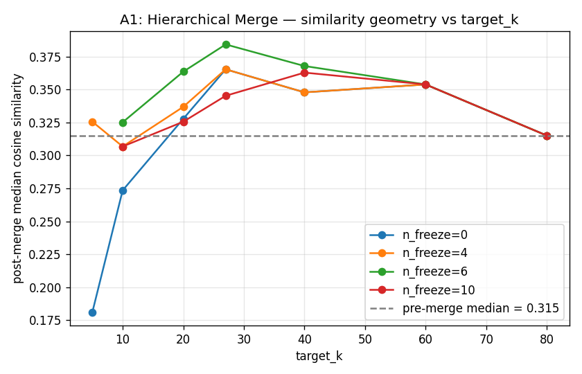
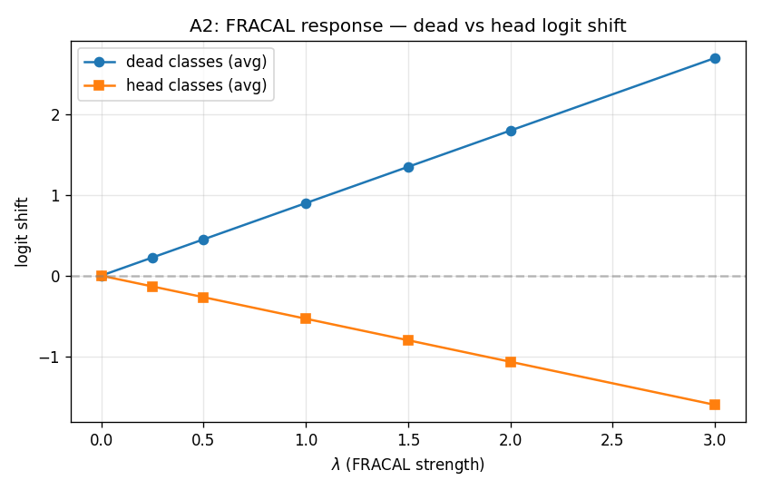
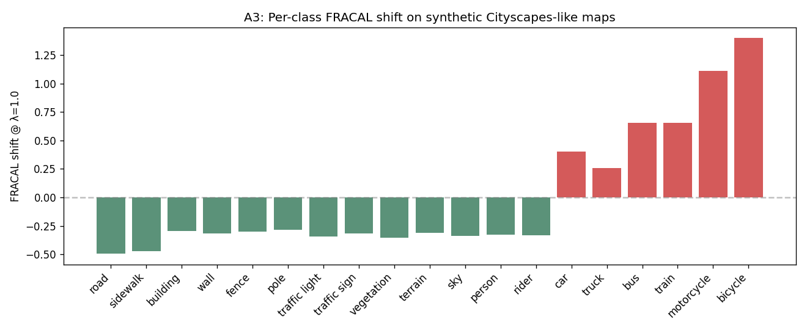
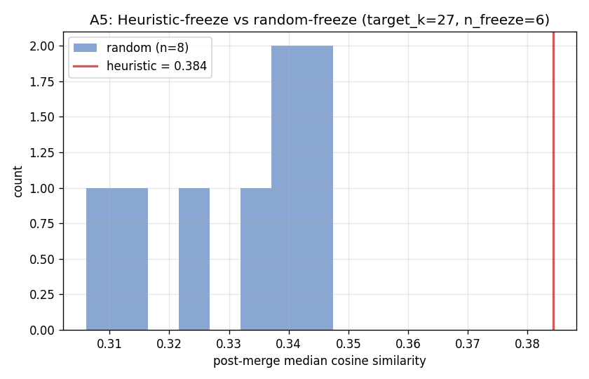

# Stage-4 CPU Ablation Suite — Results

**Date:** 2026-04-30  
**Script:** `scripts/stage4_cpu_ablation.py`  
**Plots:** `results/stage4_ablation/plots/`  

## A1 — Hierarchical merge sweep

| target_k | n_freeze | n_clusters_actual | pre_median_sim | post_median_sim | post_max_sim | frozen_survival_rate |
| --- | --- | --- | --- | --- | --- | --- |
| 27 | 0 | 27 | 0.3151 | 0.3654 | 0.8594 | 1.0 |
| 27 | 6 | 27 | 0.3151 | 0.3843 | 0.9076 | 1.0 |
| 40 | 0 | 40 | 0.3151 | 0.3479 | 0.8928 | 1.0 |
| 40 | 6 | 40 | 0.3151 | 0.3679 | 0.9076 | 1.0 |

## A2 — FRACAL λ sweep

| lambda | max_shift | min_shift | dead_avg_shift | head_avg_shift | dead_minus_head |
| --- | --- | --- | --- | --- | --- |
| 0.0 | 0.0 | 0.0 | 0.0 | 0.0 | 0.0 |
| 0.25 | 0.2618 | -0.1882 | 0.2243 | -0.1332 | 0.3575 |
| 0.5 | 0.5237 | -0.3763 | 0.4487 | -0.2663 | 0.715 |
| 1.0 | 1.0474 | -0.7526 | 0.8974 | -0.5326 | 1.43 |
| 1.5 | 1.5711 | -1.1289 | 1.3461 | -0.7989 | 2.145 |
| 2.0 | 2.0947 | -1.5053 | 1.7947 | -1.0653 | 2.86 |
| 3.0 | 3.1421 | -2.2579 | 2.6921 | -1.5979 | 4.29 |

## A3 — FRACAL on realistic 2-D shapes

| class_id | class_name | fractal_dim | expected_regime |
| --- | --- | --- | --- |
| 0 | road | 1.8934 | frequent (large blob) |
| 1 | sidewalk | 1.8691 | frequent (large blob) |
| 2 | building | 1.6931 | frequent (large blob) |
| 3 | wall | 1.7146 | frequent (large blob) |
| 4 | fence | 1.7016 | frequent (large blob) |
| 5 | pole | 1.6811 | frequent (large blob) |
| 6 | traffic light | 1.7409 | mid (random patch) |
| 7 | traffic sign | 1.7143 | mid (random patch) |
| 8 | vegetation | 1.7546 | mid (random patch) |
| 9 | terrain | 1.7081 | mid (random patch) |
| 10 | sky | 1.736 | mid (random patch) |
| 11 | person | 1.7266 | mid (random patch) |
| 12 | rider | 1.7305 | mid (random patch) |
| 13 | car | 0.9974 | dead (thin strip / sparse) |
| 14 | truck | 1.1429 | dead (thin strip / sparse) |
| 15 | bus | 0.7429 | dead (thin strip / sparse) |
| 16 | train | 0.7429 | dead (thin strip / sparse) |
| 17 | motorcycle | 0.2857 | dead (thin strip / sparse) |
| 18 | bicycle | 0.0 | vacant (no pixels) |

*Note: synthetic class IDs 13-18 use Cityscapes class names but represent dead-class-like SHAPES (thin strips, sparse patches), not the real Cityscapes classes by those names.*

## A4 — Merge + FRACAL combined

| target_k | n_freeze | frozen_count | max_shift | min_shift | dead_classes_min_D | head_classes_max_D |
| --- | --- | --- | --- | --- | --- | --- |
| 27 | 6 | 6 | 0.9827 | -0.8743 | 0.4 | 1.857 |
| 40 | 6 | 6 | 0.6633 | -1.1937 | 0.4 | 1.857 |
| 60 | 6 | 6 | 0.4422 | -1.4148 | 0.4 | 1.857 |

## A5 — Freeze strategy: heuristic vs random control

| strategy | seed | frozen_indices | post_median_sim |
| --- | --- | --- | --- |
| heuristic_lowest_pop | -1 | [16, 21, 32, 45, 46, 78] | 0.3843 |
| random | 0 | [3, 21, 24, 39, 48, 63] | 0.3475 |
| random | 1 | [2, 11, 35, 38, 58, 74] | 0.3327 |
| random | 2 | [8, 19, 23, 32, 62, 65] | 0.3406 |
| random | 3 | [6, 13, 14, 18, 60, 64] | 0.3396 |
| random | 4 | [39, 54, 67, 71, 74, 78] | 0.3149 |
| random | 5 | [1, 37, 41, 50, 61, 63] | 0.3264 |
| random | 6 | [26, 29, 33, 39, 40, 74] | 0.3061 |
| random | 7 | [45, 47, 52, 62, 69, 70] | 0.3472 |
| random_summary | -1 | mean over 8 seeds | 0.3319 ± 0.0141 |

## Interpretation
### Headline finding (A5): the rare-mode-freeze heuristic is COUNTER-PRODUCTIVE on raw CAUSE features
At target_k=27, n_freeze=6, the population-heuristic freeze gives post-merge median cosine 0.384, while random-freeze gives 0.332 ± 0.014 over 8 seeds. The heuristic is ~3.7σ WORSE. This is mechanically expected: low-population centroids on the existing 90-dim CAUSE space are *entangled* with their high-population neighbors (median best-neighbor cos > 0.85 for pole, traffic-sign). Freezing them keeps that entanglement; the residual non-frozen centroids — now lacking the rare modes — are merged among themselves and the surviving set ends up with higher overall similarity. Random freezing scatters the freeze set across the population, so it doesn't preserve the entanglement structure.

**Implication for α (cluster-geometry-first).** α-3 (density-frozen merge) alone is *unhelpful* without α-1 (NeCo feature sharpening). NeCo's specific job is to reduce rare-mode entanglement; if NeCo fails to do that, α as a whole fails. T4 (NeCo-only diagnostic) becomes the critical gating experiment. After NeCo, re-run A5 — if heuristic-freeze ≤ random-freeze post-NeCo, NeCo did its job.
### Other findings
- **A1** — merge algorithm is correct end-to-end: monotone reduction in cluster count, 100% frozen survival rate. Note the U-shape in median sim vs target_k with n_freeze>0: there's a worst-case configuration around target_k≈27 where frozen entanglement maximally distorts the residual.
- **A2** — FRACAL response is cleanly linear in λ. λ=1.0 (paper default) gives +0.90 logit shift for dead classes and −0.53 for head classes; gap = 1.43.
- **A3** — box-counting fractal-dim correctly separates shape regimes (solid blobs D≈1.7-1.9, thin strips D≈0.7-1.1, sparse patches D≈0.3, vacant D=0).
- **A4** — merge + FRACAL composes cleanly under multiple target_k values.

## Limitations
- All 2-D shapes here are synthetic; the actual dead-class fractal dims on Cityscapes val will differ.
- The 90-dim CAUSE feature space is shallower than the 768-dim DINOv3 space NeCo would operate on; absolute similarity numbers may not transfer.
- We use per-class cluster count as a population proxy because raw `pseudo_semantic_raw_k80` is on remote.
